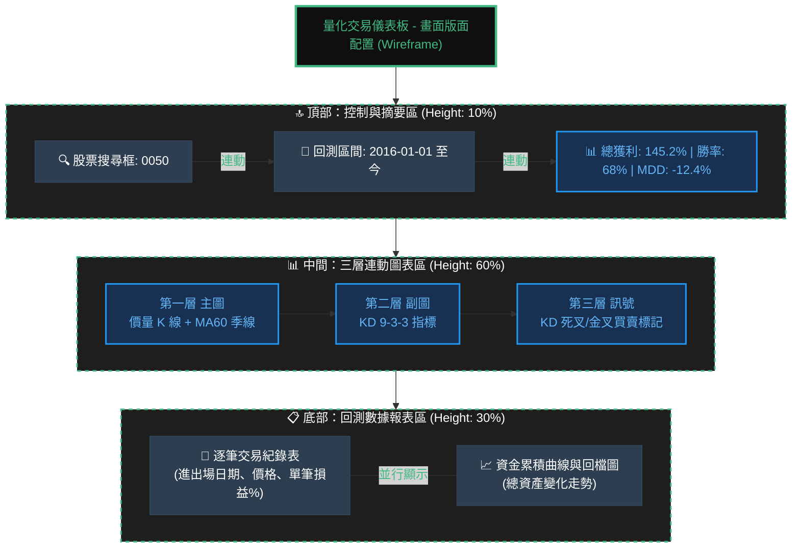
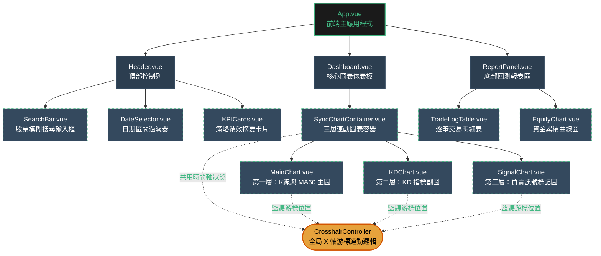

# Vue 3 股票量化交易儀表板

## 1️⃣ 畫面版面配置 (Wireframe)



## 2️⃣ Vue 3 組件架構樹



## 🎯 架構關鍵要點

### 版面設計
- **頂部 (10%)**: 搜尋、日期篩選、績效指標
- **中間 (60%)**: 三層連動K線圖表，共用游標與時間軸
- **底部 (30%)**: 交易紀錄表 + 資金曲線圖

### 組件特性
✅ **三層連動圖表**: MainChart → KDChart → SignalChart  
✅ **共用游標控制器**: CrosshairController 管理全局 X 軸位置  
✅ **狀態共享**: 虛線表示組件間的狀態監聽關係  
✅ **響應式佈局**: 使用 Flexbox 自動調整高度比例

### 資料流向
```
搜尋/日期篩選 → API 請求 → 圖表資料更新 → 三層圖表同步 → 回測報表更新
```
